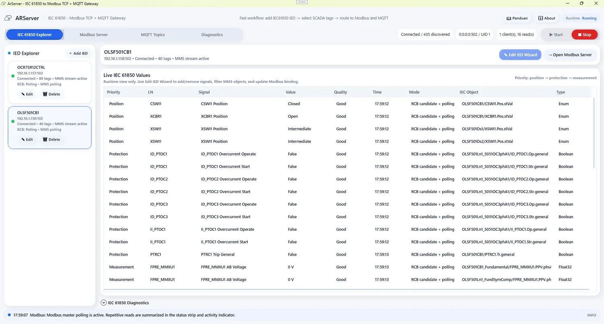
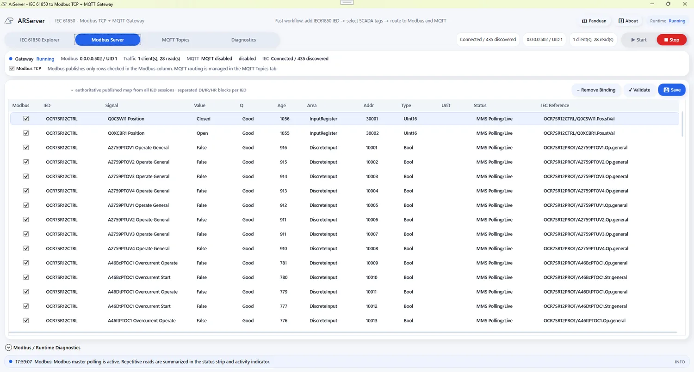
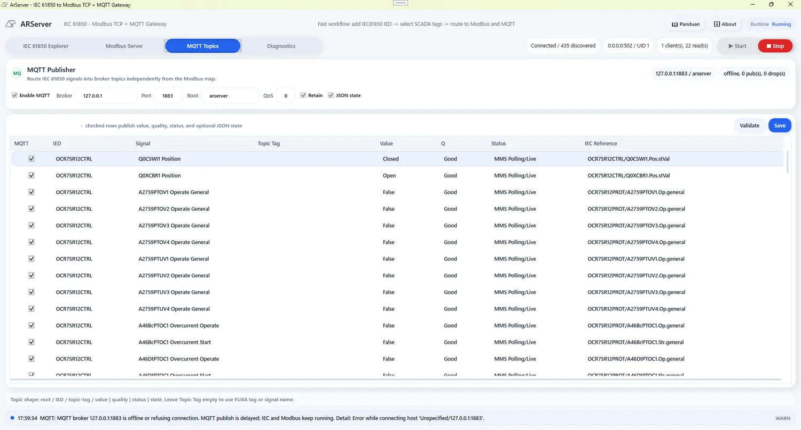

# ARServer

ARServer is a Windows desktop gateway for publishing IEC 61850 MMS data to Modbus TCP and MQTT for HMI/SCADA tools such as FUXA.

The project is built for substation and relay-bench workflows where operators need a readable IEC 61850 explorer, a deterministic Modbus map, configurable MQTT topic routing, and diagnostics that separate real communication failures from normal polling noise.

[Download the latest Windows installer](https://github.com/masarray/arserver/releases)

## Screenshots

### Start Workspace


### Live IEC 61850 Values



### Modbus TCP Server Map



### MQTT Topic Routing



## What It Does

- Connects to IEC 61850 MMS relays using a real libiec61850-based adapter when the runtime DLLs are available.
- Provides a mock IEC 61850 mode for UI, mapping, and Modbus gateway testing without a relay.
- Imports SCL/CID/SCD files and helps select SCADA-ready signals.
- Builds Modbus TCP bindings for coils, discrete inputs, input registers, and holding registers.
- Runs a read-only Modbus TCP server for HMI polling.
- Publishes the same IEC 61850 runtime values to MQTT so HMI clients can subscribe instead of polling.
- Shows runtime diagnostics, IEC activity, Modbus polling status, stale values, and per-signal quality.

## Current Scope

ARServer is currently a WPF/.NET 8 Windows application focused on IEC 61850 MMS polling, Modbus TCP publishing, and MQTT publishing through an external broker.

The UI already supports a multi-IED workspace model, but the runtime architecture should still be treated as a careful field tool in active development. Validate mappings and communication behavior on a test bench before connecting it to operational environments.

## Requirements

- Windows 10 or later
- .NET 8 SDK for building from source
- Inno Setup 6 if you want to rebuild the Windows installer locally
- Optional real IEC 61850 runtime DLLs copied beside the built executable:
  - `iec61850dotnet.dll`
  - `iec61850.dll`
- Optional MQTT broker for MQTT output, for example Eclipse Mosquitto.

Without those DLLs, ARServer can still run in mock mode for mapping and Modbus TCP testing.

## Download Release

Ready-to-install Windows builds are published on GitHub Releases:

https://github.com/masarray/arserver/releases

The release package is a ZIP containing an Inno Setup installer for Windows x64. The installer includes the GPL-3.0 license, README, and third-party notices.

## Build

```powershell
dotnet build ARServer.sln
```

Build output is written under:

```text
bin\Debug\net8.0-windows\
```

## Run

Open the solution in Visual Studio, or run the built WPF executable from the build output folder.

For real relay testing:

1. Copy the libiec61850 .NET/native DLLs beside `ArServer.exe`.
2. Start ARServer.
3. Add or connect an IED by IP address and MMS port, usually TCP `102`.
4. Select SCADA/HMI signals.
5. Build or validate the Modbus map.
6. Enable Modbus TCP, MQTT, or both.
7. Start runtime and point the HMI client to the selected output.

## Modbus Mapping Guidance

Recommended area policy:

- Protection and status booleans: Discrete Input / FC02 / `1xxxx`
- Position enums: Input Register / FC04 / `3xxxx`
- Analog Float32 values: Holding Register / FC03 / `4xxxx`
- Quality, age, and sequence metadata: Holding Register / FC03 / `4xxxx`

For multi-IED planning, keep address separation inside each Modbus area. Example:

- IED-01: DI `10001+`, IR `30001+`, HR `40001+`
- IED-02: DI `11001+`, IR `31001+`, HR `41001+`
- IED-03: DI `12001+`, IR `32001+`, HR `42001+`

## MQTT Output

MQTT output is implemented as a publisher to an external MQTT broker. This keeps ARServer small and interoperable while allowing production deployments to use hardened brokers such as Mosquitto, EMQX, or HiveMQ.

Default MQTT settings:

- Broker: `127.0.0.1`
- Port: `1883`
- Topic root: `arserver`
- QoS: `0`
- Retain last value: enabled
- JSON state payload: enabled

Topic layout:

```text
arserver/{iedName}/{tagName}/value
arserver/{iedName}/{tagName}/quality
arserver/{iedName}/{tagName}/status
arserver/{iedName}/{tagName}/state
arserver/status
```

The `/value` topic is a simple scalar payload for HMI tags. The `/state` topic is JSON for richer dashboards and diagnostics.

Modbus TCP and MQTT can be enabled independently. The IEC 61850 relay is still read once by ARServer; enabled outputs receive values from the same runtime cache.

## Repository Layout

```text
ARServer.sln
ARServer.csproj
MainWindow.xaml / MainWindow.xaml.cs
Models/
Services/
Assets/
```

Key service classes:

- `Services/BridgeRuntime.cs` coordinates IEC polling and Modbus publishing.
- `Services/MqttGatewayPublisher.cs` publishes selected runtime values to MQTT topics.
- `Services/ModbusTcpServer.cs` implements the read-only Modbus TCP server.
- `Services/RealLibIec61850Client.cs` adapts libiec61850.NET through reflection.
- `Services/SclImportService.cs` imports SCL/CID/SCD signal definitions.

## Safety Notes

ARServer is read-only on the Modbus side by design. Write functions are rejected to avoid accidental relay or process control from an HMI client.

For field use, verify:

- IEC object references and functional constraints.
- Modbus address ranges and data types.
- Word order for Float32 values.
- Stale/quality behavior during relay disconnects.
- Network segmentation, firewall rules, and port exposure.

## License

ARServer is open source under the GNU General Public License v3.0 or later. See [LICENSE](LICENSE).

Third-party dependency notices are listed in [THIRD_PARTY_NOTICES.md](THIRD_PARTY_NOTICES.md).


## Using the Software

ARServer is a Windows gateway application, not a cloud service. The landing page in `docs/` is only product documentation; the actual gateway runs locally on Windows.

For real IEC 61850 and MQTT operation:

1. Install ARServer from [GitHub Releases](https://github.com/masarray/arserver/releases), or build it from source.
2. For real IED communication, copy `iec61850dotnet.dll` and `iec61850.dll` beside `ArServer.exe`.
3. Start an MQTT broker such as Mosquitto, EMQX, or HiveMQ if MQTT output is enabled.
4. Add an IED by IP address and MMS port.
5. Discover IEC 61850 objects, select SCADA/HMI signals, and validate the Modbus map.
6. In the MQTT tab, select which signals publish to broker topics.
7. Start runtime and connect FUXA/HMI either through Modbus TCP or MQTT.
